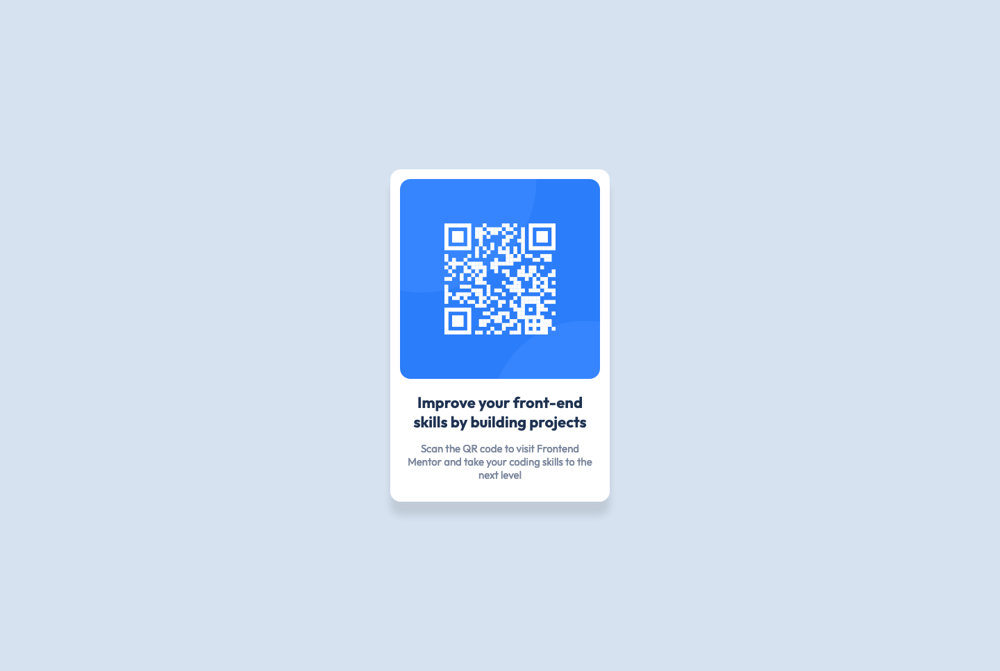

# Frontend Mentor - QR code component solution

This is a solution to the [QR code component challenge on Frontend Mentor](https://www.frontendmentor.io/challenges/qr-code-component-iux_sIO_H). Frontend Mentor challenges help you improve your coding skills by building realistic projects. 

## Table of contents

  - [Screenshot](#screenshot)
  - [Links](#links)
  - [Built with](#built-with)
  - [What I learned](#what-i-learned)
  - [Useful resources](#useful-resources)
- [Author](#author)

### Screenshot

### Links

- Solution URL: [Repository](https://github.com/XODesigns/QR-code-component-challenge)
- Live Site URL: [Challenge Live Url](qr-code-component-challenge-xodesigns.vercel.app)

### Built with

- Semantic HTML5 markup
- Non-semantic HTML5 markup
- CSS custom properties
- VS Code

### What I learned

For me it was a recap on what i learnt before. i have spent more time in using cms's leading to me putting more faith in its already built components. This was refreshing, although small, kept me engaged.

### Useful resources

- [Example resource 1](https://developer.mozilla.org/) - aligning of divs (display:flex , justify-content & align-items), box-shadow 

## Author

- Website - [Xolelani Mdima](https://xodesigns.github.io/CV/)
- Frontend Mentor - [@XODesigns](https://www.frontendmentor.io/profile/XODesigns)

